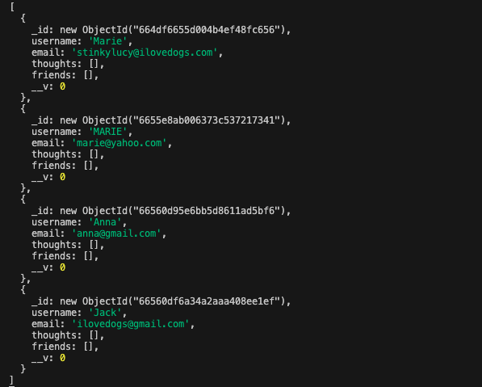

# NoSQL Challenge: Social Network API

I built an API for a social network web application where the users can share their thoughts, react to their friends' thoughts, and create a friend list. I used express.js and monogoDB.

## Installation
In the terminal, run ```npm install``` to install the necessary files associated with mongoose and express. After installing, run ```npm run start``` for the live link. To use this app, open the local host in the Insomnia app.


## Usage
Users can see the data populate in the Insomnia app, where you can get all users, get a single user, create and delete users, and add and remove friends. You can also see all thoughts, a single thought, create, upload, and delete thoughts and create reactions and delete reactions. Attached is a video walkthough of the app: https://drive.google.com/file/d/19-a886i7cA76on_VZaa-IFOT6cpXTQmi/view?usp=sharing 

 

## Credits
My name is Marie DeVoll and I am a full stack developer in training

## License
Standard MIT license